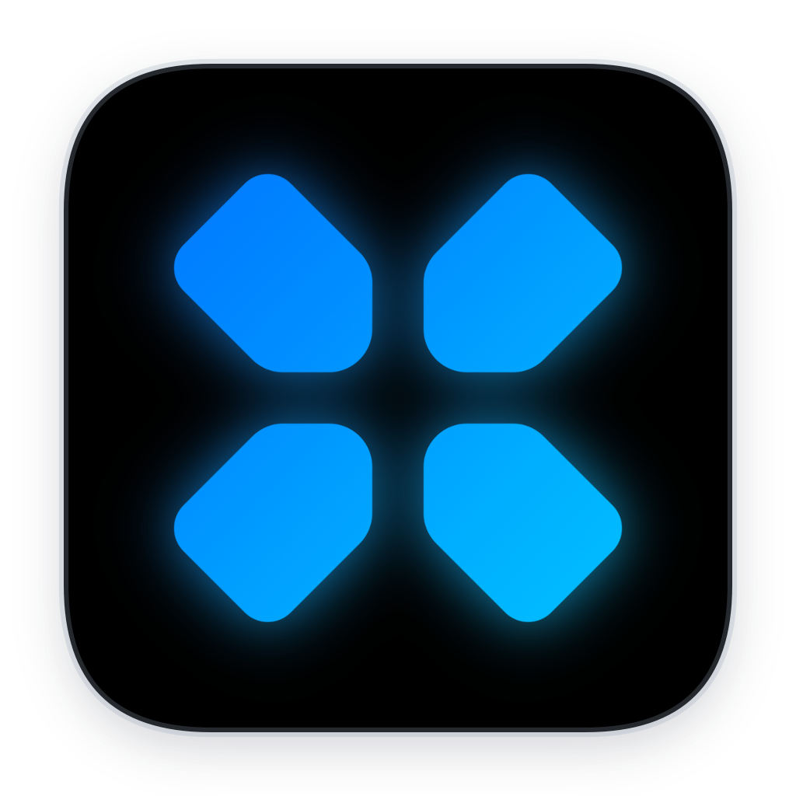
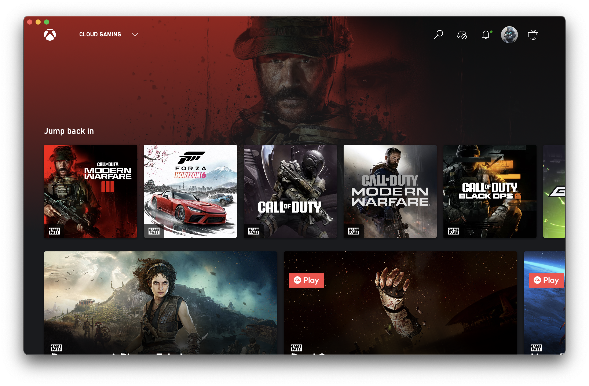
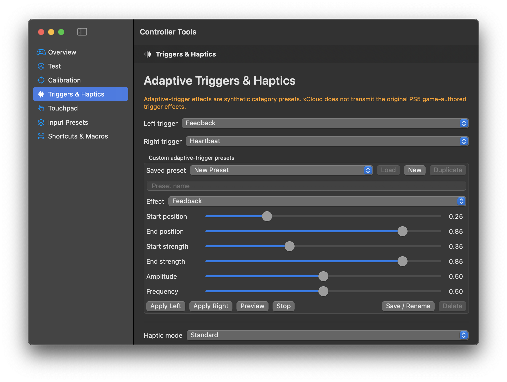
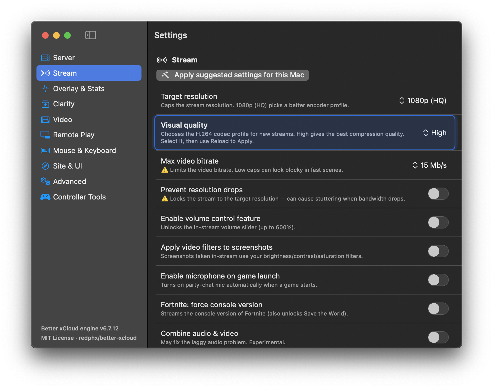
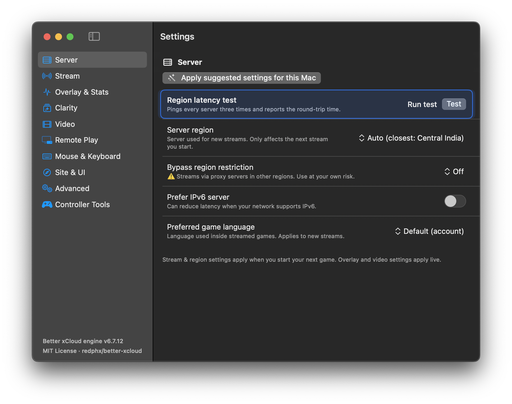
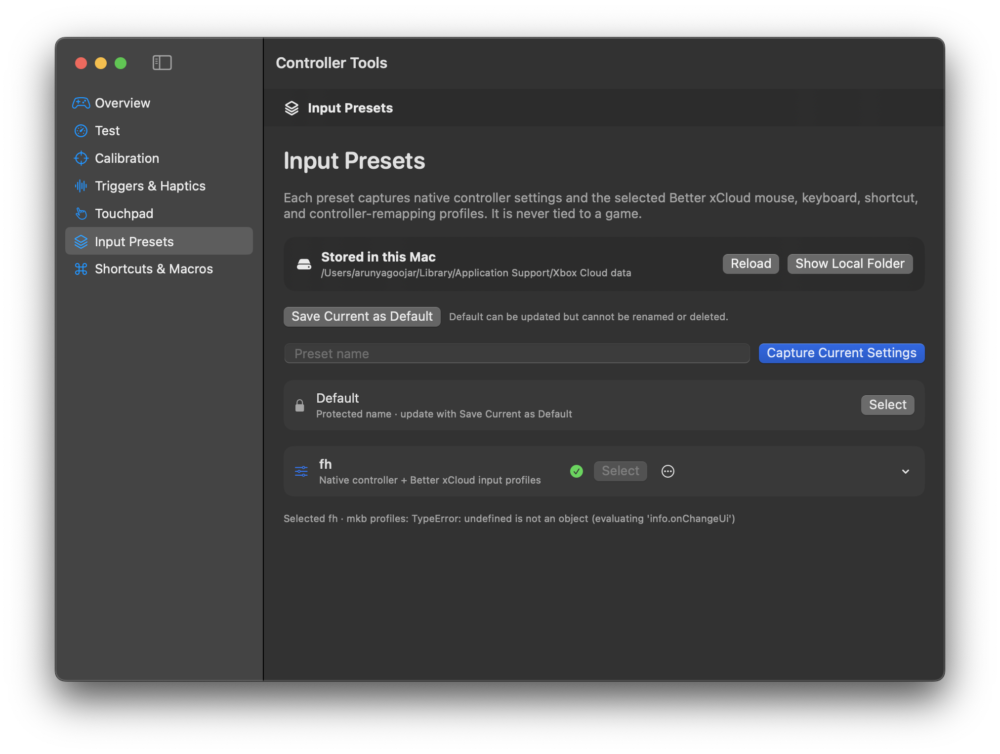
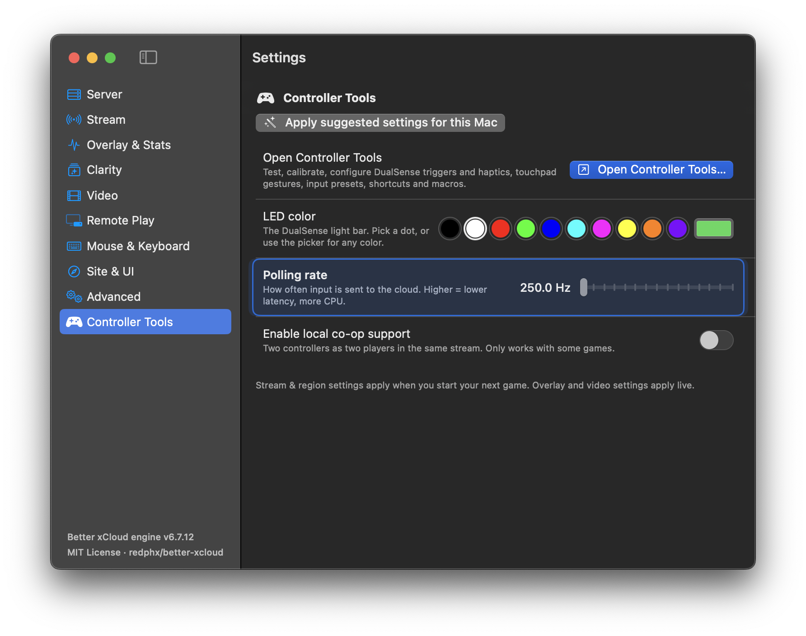

<div align="center">
  
  <h1>Mac Xcloud</h1>
  <p><strong>A focused, native-feeling Xbox Cloud Gaming experience for macOS.</strong></p>
  <p>
    <a href="https://github.com/arunyagoojar/Mac-XCloud/releases/latest"><strong>Download the latest release</strong></a>
    ·
    <a href="https://github.com/arunyagoojar/Mac-XCloud/releases"><strong>All releases</strong></a>
    ·
    <a href="https://github.com/arunyagoojar/Mac-XCloud/actions"><strong>Builds</strong></a>
  </p>
  <p><em>Free and open source · macOS 14.6+ · Not affiliated with Microsoft</em></p>
</div>

<br>

<div align="center">
  
</div>

## What is Mac Xcloud?

Mac Xcloud wraps the normal `xbox.com/play` experience in a clean native macOS shell. It keeps the web service and Microsoft sign-in familiar, while adding a proper Mac window, native settings, controller tools, menu-bar controls, input presets, and quality-of-life details that are easy to miss in a browser tab.

You still need the same Xbox/Game Pass access required by Xbox Cloud Gaming in a browser.

## Screenshots

<div align="center">
  
  
</div>

<div align="center">
  
  
</div>

<div align="center">
  
</div>

## Features at a glance

### The everyday experience

- **Launch straight into Xbox Cloud Gaming** — no browser tab management.
- **Persistent Microsoft sign-in** — the app uses WebKit's persistent website data store, so your session stays on this Mac.
- **Chrome-less native window** — edge-to-edge content, floating traffic lights, resize/zoom behavior, and full-screen support.
- **Xbox-style startup handoff** — the bundled boot animation plays before the page takes over.
- **Native macOS menu bar** — quick access to settings, reload, navigation, full screen, diagnostics, input presets, and updates.
- **Automatic cursor hiding** — the pointer can disappear while a controller is in use and return when the mouse moves.
- **A small, focused loading state** — no oversized loading strip covering the game.
- **Persistent connection errors** — failures remain visible instead of silently leaving a blank page.
- **No injected Better xCloud controls covering the game** — the app provides its own native settings surface.

### Stream and picture quality

- **Visual quality profiles** — Default, Low, Normal, and High when the browser supports the profile.
- **Target resolution controls** — Auto, 720p, 1080p, and 1080p HQ.
- **Bitrate control** — unlimited or selected maximum bitrate levels.
- **Resolution-drop protection** — optional, with a warning because locking resolution can cause stutter on a weak connection.
- **Clarity pipelines** — FSR 1, WebGL USM/CAS, WebGPU USM/CAS, and native/default paths where supported.
- **Brightness, contrast, saturation, sharpness, processing mode, frame-rate, and renderer controls.**
- **Hardware-aware H.264 capability handling** — the app exposes supported codec profiles correctly so High does not silently fall back to Default.
- **Reload-to-apply behavior** — renderer/codec changes clearly identify when a reload is needed.

### Live diagnostics and networking

The menu bar can show:

- Current game
- Region
- Resolution
- Ping
- FPS
- Bitrate
- Packet loss
- Dropped frames
- Decode time
- Jitter

There is also a native **region ping test** for finding the closest responsive Xbox region.

### Controller support

The browser remains authoritative for the physical browser Gamepad, while native tools add controller features without replacing the web controller object.

- **DualSense adaptive triggers** with the full 21-mode catalog:
  - Standard: Off, Feedback, Weapon, Bow & Arrow, Vibration
  - Racing: Acceleration, Deceleration, Engine Strain, Braking
  - Weapons: Pistol Fire, Shotgun Fire, SMG Fire, Sniper Fire
  - Specialized: Galloping, Machine Gun
  - Immersive: Fishing, Trigger Jam, Door Resistance, Electric Shock, Heartbeat, Rain
- **Left and Right Trigger app-menu controls** for quick mode selection.
- **Custom adaptive-trigger presets** — create, edit, rename, duplicate, preview, stop, save, and delete.
- **Haptic feedback controls** — standard, amplified, off, intensity, sharpness, locality, and test pulses.
- **LED control** — system mode, off, fixed color, battery-aware modes, custom RGB colors, brightness, and low-battery behavior.
- **Touchpad gestures** — tap, double-tap, swipe, two-finger gestures, mappings, and a touchpad demo.
- **Controller test screen** — buttons, sticks, triggers, battery, capabilities, LED, touchpad, haptics, and live snapshots.
- **Calibration** — stick centers, full range, trigger range, dead-zone and response-curve tools.
- **Shortcuts** — controller combinations for settings, full screen, screenshots, stats, volume, mute, and custom actions.
- **Finite macros** — button, haptic, native-action, and timed steps with lifecycle resets.
- **Controller reconnect recovery** — native polling restarts after a controller disappears and returns.
- **Single controller identity** — native input, metadata, LED, haptics, and adaptive triggers use the same selected controller.

### Input presets

- **Protected Default preset** — updateable, but cannot be renamed or deleted.
- **Named custom presets** — capture the current controller, trigger, haptic, LED, touchpad, shortcut, macro, mouse, keyboard, and Better xCloud profile state.
- **Create, select, update, rename, duplicate, delete, and restore presets.**
- **Local, readable JSON storage** in:
  `~/Library/Application Support/Xbox Cloud data/`
- Separate folders for input presets and adaptive-trigger presets, with an index, checksums, revisions, and tombstones.
- Hardware calibration stays local to the physical controller rather than being copied into portable presets.

<div align="center">
  
</div>

### Mouse and keyboard

- Better xCloud mouse-and-keyboard enablement and native mode settings.
- Virtual-controller profiles and player slots.
- Keyboard shortcut profiles.
- Controller shortcut and customization profiles.
- Portable profile payload capture so presets are not dependent only on local numeric IDs.
- Native profile editors for mouse, keyboard, controller shortcuts, and controller customization.

### Window and focus behavior

- Separate native windows for the main stream, Settings, Controller Tools, and profile editors.
- Controller UI navigation is routed only to the active native consumer window.
- Controller Tools and profile windows do not steal the browser's physical Gamepad path when they are not consuming controller navigation.
- Sticky material-backed headers in Settings and Controller Tools.
- Safe window reuse and cleanup for close/reopen flows.

### Automatic updates

- **Sparkle 2** is built into official releases.
- Installed copies check the signed feed automatically.
- **Check for Updates…** is available in the app menu and menu-bar menu.
- Every push to `main` builds and publishes a signed GitHub Release automatically.
- No manual export, zip, upload, or version bump is required.

## Download the official release (recommended)

1. Open the [latest release](https://github.com/arunyagoojar/Mac-XCloud/releases/latest).
2. Download `MacXcloud.zip`.
3. Unzip it and move **Mac Xcloud.app** to `/Applications`.
4. On the first launch, right-click the app → **Open** → confirm macOS's warning.
5. After the first launch, Sparkle handles future updates automatically.

This project is not notarized because notarization requires Apple's paid Developer Program. macOS may therefore show a Gatekeeper warning on first launch.

## Build from source with Xcode (optional)

Most users should use the official release. If you want to build the app yourself:

```bash
git clone https://github.com/arunyagoojar/Mac-XCloud.git
cd Mac-XCloud
open "Mac XCloud.xcodeproj"
```

In Xcode:

1. Select the **Mac XCloud** scheme.
2. Choose **My Mac** as the destination.
3. Click **Product → Build** (`⌘B`).
4. For a local unsigned build, use the project's automatic/local signing settings.

Or build from Terminal:

```bash
xcodebuild -project "Mac XCloud.xcodeproj" \
  -scheme "Mac XCloud" \
  -configuration Release \
  -destination "platform=macOS" \
  CODE_SIGN_IDENTITY=- \
  CODE_SIGNING_REQUIRED=NO \
  build
```

## Releasing a change (maintainers)

A normal push is enough:

```bash
git add -A
git commit -m "Describe the change"
git push origin main
```

GitHub Actions builds the app, signs the Sparkle archive, creates the GitHub Release, and updates the appcast. `./release.sh "Describe the change"` is an optional helper that does the same thing and watches the workflow.

## Compatibility and troubleshooting

- Minimum deployment target: **macOS 14.6**.
- A wired controller connection is recommended when Bluetooth HID reconnects are unstable.
- If the controller was connected before Mac Xcloud launched, the app retries WebKit Gamepad discovery during startup so the Xbox page can see it.
- If controller input disappears, reload the Xbox page once. If the issue repeats, reconnect the controller or test USB; macOS WebKit/GameController has a known disconnect assertion that the app can detect but cannot fully prevent with public APIs.
- Microsoft/Xbox authentication remains inside WebKit's website data store; presets do not copy cookies or tokens.

## Credits and legal

- [Better xCloud](https://github.com/redphx/better-xcloud) by redphx — bundled engine v6.7.12 under the MIT License. Copyright belongs to the Better xCloud contributors.
- Xbox Cloud Gaming is a Microsoft service. Mac Xcloud is an independent wrapper and is not affiliated with or endorsed by Microsoft.
- Game artwork shown in screenshots belongs to its respective publishers and is included only as UI context.
