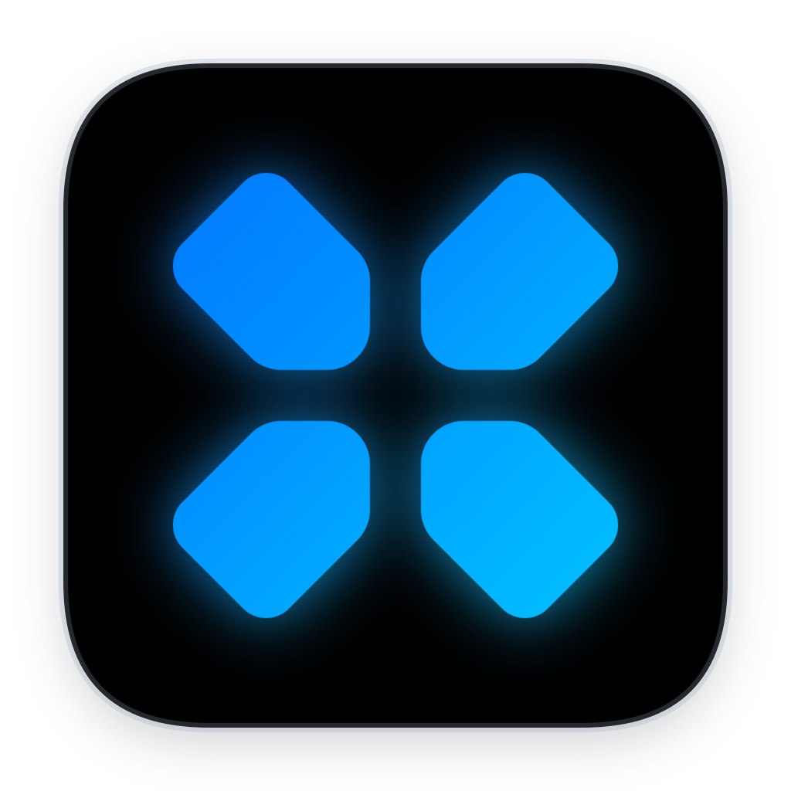
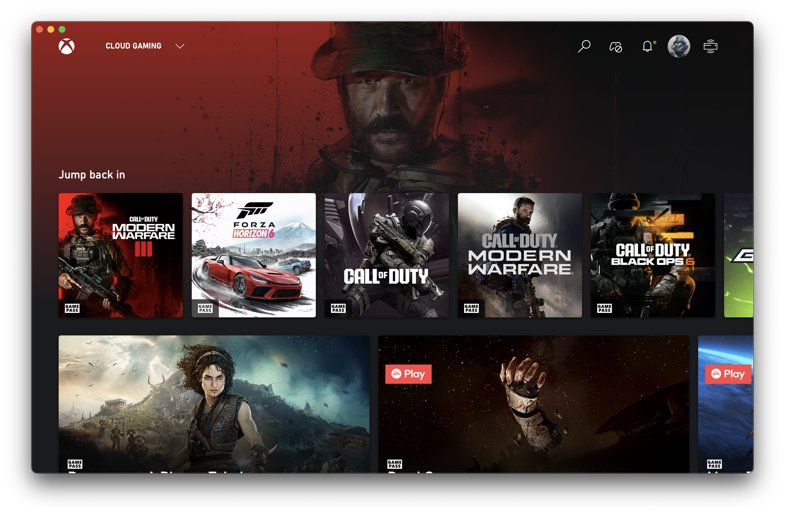
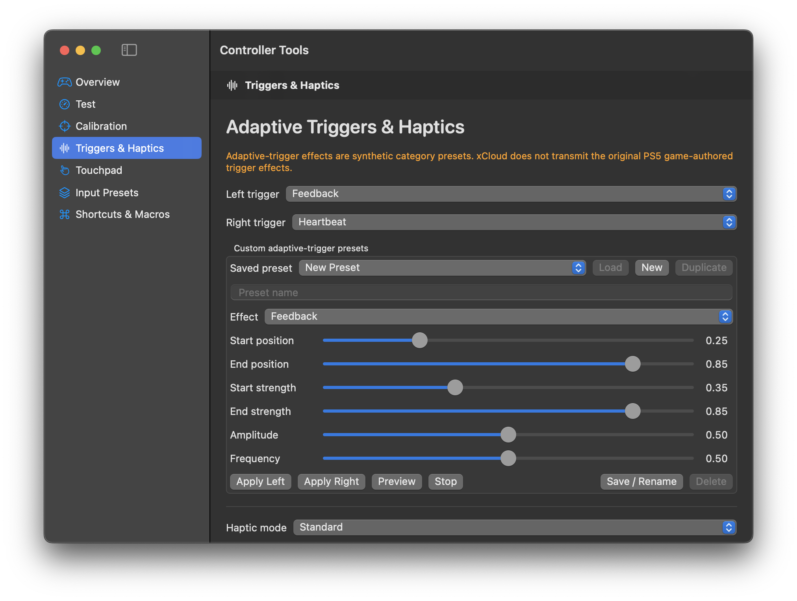
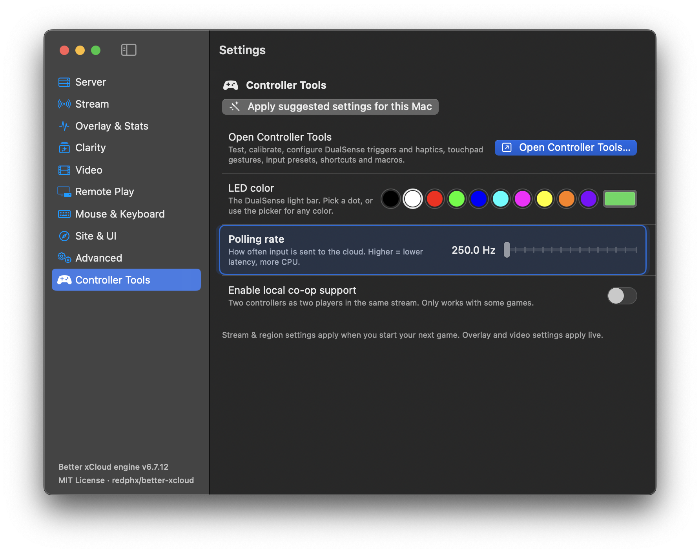
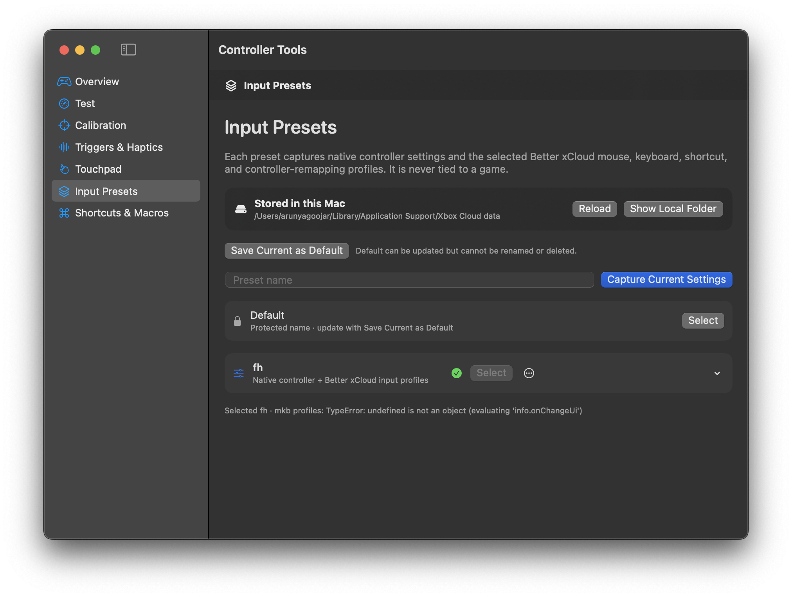
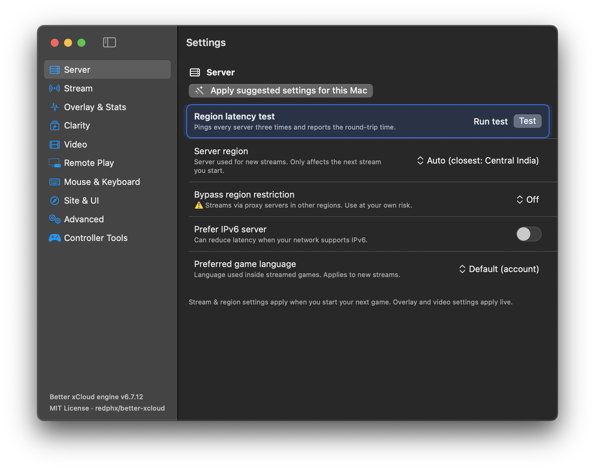

<div align="center">
  
  <h1>Mac Xcloud</h1>
  <p><strong>Xbox Cloud Gaming and Xbox Remote Play in a dedicated native Mac app.</strong></p>
  <p>
    <a href="https://github.com/arunyagoojar/Mac-XCloud/releases/latest"></a>
    
    
    <a href="https://ko-fi.com/arunyagoojar"></a>
  </p>
  <p>
    <a href="#key-features">Key Features</a> · 
    <a href="#screenshots">Screenshots</a> · 
    <a href="#dualsense-adaptive-trigger-modes">Adaptive Triggers</a> · 
    <a href="#motion-steering--gyro-aiming">Motion & Steering</a> · 
    <a href="#deep-links">Deep Links</a> · 
    <a href="#app-shortcuts">Shortcuts</a> · 
    <a href="#installation--requirements">Download</a> · 
    <a href="#building-from-source">Build from Source</a>
  </p>
</div>

---

**Mac Xcloud** combines the Xbox web ecosystem and [Better xCloud](https://github.com/redphx/better-xcloud) with native macOS APIs, delivering an edge-to-edge desktop experience for **Xbox Cloud Gaming** and **Xbox Remote Play**.

Running in Apple's native `WKWebView`, stream video benefits from custom WebKit compatibility shims and optional WebGL/WebGPU clarity pipelines, while controller input, DualSense adaptive triggers, motion steering, and live diagnostics are handled directly by native macOS frameworks (`GameController`, `CoreHaptics`).

> [!NOTE]
> You need an active Xbox Game Pass Ultimate subscription, account, and region access required by Xbox to stream cloud titles. Remote Play connects directly to your own configured Xbox console. This open-source project is independent of and not endorsed by Microsoft or Sony.

---

## Screenshots

<div align="center">
  
  <p><em>Edge-to-edge cloud gaming interface with custom window drag controls and native HUD.</em></p>
</div>

<br>

| Stream & Video Settings | Controller Calibration & Visualizer |
| :---: | :---: |
|  |  |

| DualSense Adaptive Triggers & Haptics | Per-Game Profile Auto-Switching |
| :---: | :---: |
|  |  |

---

## Key Features

### 🖥️ Native macOS Experience
- **Edge-to-Edge Chromeless Window**: Custom drag strip under floating macOS traffic lights with zoom/fullscreen support. The main window remembers its size and position on each display.
- **Boot Animation**: The Mac Xcloud launch animation plays over the loading page while WebKit prepares the stream; the page loads in the background the whole time.
- **Keep-Awake While Running**: The Mac's display and system sleep are suppressed while the app is open, so long sessions aren't interrupted.
- **Quit Confirmation**: Quitting during an active stream asks for confirmation first.
- **Persistent Microsoft Authentication**: Dedicated cookie and local storage isolation keeps you signed in between launches.
- **Native Settings**: A System Settings–style window with a searchable sidebar, plain-language options, live previews for motion and touch controls, and advanced tuning tucked away until you need it.
- **Background Menu Bar Companion**: Quick menu bar status item with instant access to settings, trigger presets, and stream actions.
- **Automatic Updates**: Built-in [Sparkle](https://sparkle-project.org/) framework delivers seamless background checks with detailed, versioned release notes.
- **Deep Links**: `macxcloud://play/<game-id>` launches a game directly, `macxcloud://resume` reopens your last game, and `macxcloud://home` returns to the start page. Works from the Terminal (`open "macxcloud://…"`), Raycast, Alfred, Shortcuts, or browser links. The current game's ID is shown in the Diagnostics panel with a copy button.

### 🎮 Controller Suite & DualSense Support
- **Hardware Calibration**: Live stick center, range calibration, customizable dead zones, and response curves (Linear, Precise Center, Quick Response, S-Curve).
- **DualSense Adaptive Triggers**: Full implementation using macOS 10-zone resistance arrays with presets matching the popular DualSenseX catalog (GameCube digital click, bow draw, machine gun recoil, staged resistance).
- **CoreHaptics & Rumble Routing**: Real-time translation of stream rumble telemetry to native body and trigger haptics with customizable rumble exponent and gain curves.
- **Trigger Lock & Stop Emulation**: Software-defined trigger stops with resistance thresholds.
- **Lightbar & Battery**: Controller battery levels mirrored into the stream status bar and the menu bar. Customizable lightbar colors, with a battery policy that dims, reddens, or switches off the light when the controller is low.
- **Low Battery Alert**: A macOS notification fires once per discharge cycle when the controller drops to about 20%.
- **"Game Ready" Alert**: When a queued game finally connects, you get a macOS notification plus three light-green lightbar pulses with a controller rumble each — so you can browse elsewhere and still know when to hop back in.

### 🏎️ Motion Steering & Gyro Aiming
Motion controls run on a gyro + accelerometer fusion that processes every sensor report (not a 60 Hz snapshot), learns the gyroscope's drift whenever the controller rests, and ignores rumble, adaptive-trigger buzz and arm movement.
- **Steering (left stick)**: Hold the controller like a wheel and turn it. The wheel angle is the controller's *bank* relative to the horizon, so tilting it toward or away from you, or turning it on the spot, never steers the car, and the center can't drift. Set the steering range and how quick the response is around center; Recenter (⌥⌘R) makes your natural hold straight ahead.
- **Gyro Aiming (right stick)**: Turn the controller to move the camera, like aiming with a mouse. Works held flat, tilted or upright, ignores hand tremor at rest, and stops the instant your hand stops. Compensates the game's own right-stick dead zone so the smallest movement registers. Active all the time or only while aiming (LT).
- **Touchpad Camera (DualSense)**: The touchpad works like a trackpad for the camera — slow strokes are precise, fast swipes turn further, and the camera stops when your finger stops or lifts. Nothing accumulates or coasts.
- **Touchpad Gestures**: Swipe and tap gestures mapped to app actions (performance overlay, full screen, screenshot, macros, and more).

### 📊 Native Performance HUD & Diagnostics
- **Pill HUD Overlay**: Lightweight macOS material overlay rendering FPS, network ping, bitrate (Mbps), decode time, packet loss, and dropped frames.
- **Customizable Appearance**: Selectable screen positions, font sizes, opacity, background blur, and conditional green/yellow/red latency coloring.
- **Quick Glance**: Momentarily summon stream metrics via controller shortcut without keeping the HUD permanently on screen.
- **Diagnostics Panel (`⇧⌘D`)**: Live inspection of WebRTC connections, Gamepad API status, bridge message latency, and hardware detection, plus the current game's ID with a copy button for deep links.

### ⚡ Stream Optimization & Video Clarity
- **1080p HQ Unlocked**: WebKit SDP shims negotiate H.264 High Profile (`profile-level-id=64001f`), preventing automatic resolution drops.
- **Clarity Pipelines**: Choose between WebGPU or WebGL2 AMD CAS and Unsharp Mask passes, applied live, with customizable sharpness and contrast.
- **Renderer Selection**: Choose between WebGL2 and WebGPU processing backends.
- **Audio & Video Customization**: Aspect ratio adjustment, video position, brightness, contrast, saturation, and volume boosting.

### 📂 Per-Game Profiles & Macros
- **Automatic Game Switching**: Automatically switches profiles based on active Xbox game IDs (with title fallback), restoring settings when leaving a stream.
- **Multi-Step Macro Engine**: Create up to 16-step timed macros with button presses, delays, native actions, and haptic pulses.
- **Hold-to-Fire (Rapid Fire)**: Repeatable trigger firing with configurable rate (2–15 pulses/sec).
- **Profile Export/Import**: Export profiles as portable JSON files to share between Macs.
- **Full Settings Backup**: Export or import all app settings and every profile as a single JSON file (Settings ▸ Backup & Restore).

### 🛡️ Connection Handling
- **Offline Detection**: If the internet drops, the app says so and reloads the page automatically once the connection returns.
- **Recovery Screens**: Load failures and stuck pages surface a Retry screen instead of hanging.

### 🏠 Xbox Remote Play
- **Direct Console Streaming**: Stream directly from your home Xbox Series X/S or Xbox One console.
- **Console List Refresh**: Automatically updates console power and connection state on open.

---

## DualSense Adaptive Trigger Modes

Mac Xcloud features a DualSenseX-inspired trigger preset catalog. Each mode maps to the physical DualSense hardware effect primitives (10 positional zones, 8 strength steps, frequency modulations):

| Mode | Behavior & Simulated Sensation |
| :--- | :--- |
| **Normal Trigger** | Standard controller resistance; keeps physical spring action. |
| **Custom Trigger Value** | User-defined parameters (mode, position, strengths, amplitude, frequency). |
| **GameCube Trigger** | Smooth initial pull followed by a hard digital wall near 78% travel with a release click. |
| **Resistance Trigger** | Continuous uniform 50% resistance from start of pull. |
| **Bow Trigger** | Progressive string drawing tension that suddenly snaps release at 78% travel. |
| **Galloping Trigger** | Alternating rhythmic pulses approximating galloping hooves. |
| **Semi Automatic Gun** | Realistic trigger wall that breaks once per pull at 44% travel with release reset. |
| **Automatic Gun** | Sustained high-frequency vibration simulating automatic rifle recoil. |
| **Machine Trigger** | Heavy, mechanical, slower-cycling vibration combined with handle haptics. |
| **Choppy Trigger** | Stepped resistance alternating across the ten hardware feedback zones. |
| **Very Soft → Hardest** | Continuous resistance ramp selectable across a 25% to 88% range. |
| **Rigid Trigger** | Maximum resistance from rest; travel is fully blocked. |
| **Calibrate Trigger** | Continuous linear ramp sweeping from zero to full force across the entire stroke. |
| **Vibrate Trigger Pulse** | Deep, rhythmic vibration pulses. |
| **Vibrate 10 Intensity** | Subtle, gentle vibration feedback. |

> [!TIP]
> Adaptive resistance requires a Sony PlayStation DualSense or DualSense Edge controller. 10-zone positional resistance is supported on macOS 12.3+ (with continuous feedback fallback on 12.0–12.2). Trigger effects are local physical simulations, not direct in-game weapon telemetry from Xbox servers.

---

## Keyboard & Mouse

* **Games with keyboard & mouse support** get them natively, exactly as in Chrome or Edge. Click the game to capture the mouse. A quick press of **Esc** goes to the game (pause menus); **hold Esc** to release the mouse.
* **Every other game** can be played with keyboard and mouse through a virtual controller (Settings → Keyboard & Mouse → Play with keyboard & mouse), with Standard and Shooter layouts and adjustable mouse sensitivity.
* **Game controllers**: PlayStation DualSense / DualSense Edge, DualShock 4, Xbox Wireless Controllers, Nintendo Switch Pro Controllers and MFi gamepads via Apple's `GameController` framework.

Why it works here: Xbox's web client enables keyboard & mouse only when the browser offers the Keyboard Lock API, pointer lock and element fullscreen. `WKWebView` lacks Keyboard Lock and denies pointer lock unless the host app grants it, so Mac Xcloud provides all three — see `KeyboardMouse.swift`.

---

## Forza Horizon: Suggested Steering Setup

Motion steering drives the game's normal left-stick steering, so configure the game's controller settings (not wheel settings):

| Mac Xcloud (Motion Controls → Steering) | Recommended Baseline |
| :--- | :--- |
| **Steering range** | 35–45° |
| **Center response** | Middle (linear); a little toward Quick for arcade handling |
| **Center boost** (Advanced) | 0% to start; raise it if small turns feel dead |
| **Smoothing** (Advanced) | Low |

*Inside Forza Horizon*:
- Steering: **Normal** to start, **Simulation** once comfortable.
- Steering Linearity: **50**.
- Steering Axis Deadzone Inside / Outside: **0 / 100**.

---

## App Shortcuts

| Action | Shortcut |
| :--- | :--- |
| **Back in website history** | `⌘[` or `Backspace` |
| **Forward in website history** | `⌘]` |
| **Xbox Home (`xbox.com/play`)** | `⇧⌘L` |
| **Open Settings** | `⌘,` |
| **Reload Page** | `⌘R` |
| **Toggle Fullscreen** | `⌃⌘F` |
| **Toggle Diagnostics Overlay** | `⇧⌘D` |
| **Settings Home** | `⇧⌘H` *(inside Settings)* |

---

## Deep Links

Mac Xcloud registers the `macxcloud://` URL scheme, so external tools can open the app at a specific spot:

| Link | Action |
| :--- | :--- |
| `macxcloud://play/<game-id>` | Starts streaming the game with that Xbox product ID (e.g. `9NPDN9R45JX4`) |
| `macxcloud://resume` | Reopens the game you played last |
| `macxcloud://home` | Opens the Xbox home page |

From the Terminal:

```bash
open "macxcloud://resume"
```

The same links work in Raycast, Alfred, Shortcuts, or any web page. To find a game's ID, start the game once and open the Diagnostics panel (`⇧⌘D`) — the current game's ID is listed there with a copy button.

---

## Installation & Requirements

### Requirements
* **macOS 12.0 (Monterey) or newer**
* Compatible with both **Apple Silicon** (M1/M2/M3/M4) and **Intel** Macs.
* A supported gamepad (DualSense recommended for adaptive triggers and gyro features).
* Xbox Game Pass Ultimate subscription (for cloud gaming) or an Xbox console (for Remote Play).

### Quick Install
1. Download **`MacXcloud.zip`** from the [Latest Release](https://github.com/arunyagoojar/Mac-XCloud/releases/latest).
2. Unzip and drag **`Mac Xcloud.app`** into your **Applications** folder.
3. Open the app and sign in with your Microsoft account.

> [!NOTE]
> Releases are ad-hoc signed. If macOS Gatekeeper displays an unidentified developer prompt, go to **System Settings → Privacy & Security** and click **Open Anyway**.

---

## Building from Source

### Prerequisites
* Mac running macOS 14+ or newer.
* **Xcode 16+** (with macOS SDK).

### Build Instructions

```bash
# Clone the repository
git clone https://github.com/arunyagoojar/Mac-XCloud.git
cd Mac-XCloud

# Build the universal release application
xcodebuild -project "Mac XCloud.xcodeproj" \
  -scheme "Mac XCloud" \
  -configuration Release \
  -destination "platform=macOS" \
  ARCHS="arm64 x86_64" \
  ONLY_ACTIVE_ARCH=NO \
  CODE_SIGN_IDENTITY="-" \
  CODE_SIGNING_REQUIRED=NO \
  CODE_SIGNING_ALLOWED=YES \
  build
```

The compiled application bundle will be located in `build/Build/Products/Release/Mac Xcloud.app`.

### Running Contract Tests

Automated regression and validation suites verify trigger math, profile encoding, and bridge compatibility:

```bash
# Run controller mathematical contract suite
./Tests/run-controller-contracts.sh

# Run preset store encoding contracts
./Tests/run-preset-store-contracts.sh

# Keyboard & mouse web contract in a real WKWebView
./Tests/run-webkit-contracts.sh

# Injected script and bridge contracts
for test in Tests/*.cjs; do node "$test"; done
```

---

## Credits & Acknowledgements

* Built upon the open-source userscript [Better xCloud](https://github.com/redphx/better-xcloud) created by [redphx](https://github.com/redphx).
* Automatic updates powered by the [Sparkle Project](https://sparkle-project.org/).
* AMD FidelityFX CAS (Contrast-Adaptive Sharpening) licensed under MIT by Advanced Micro Devices, Inc.

### Support Development
If you enjoy using Mac Xcloud, consider [supporting ongoing development on Ko-fi](https://ko-fi.com/arunyagoojar).

---

## License & Legal Disclaimer

This project is licensed under the open-source MIT License.

*Xbox, Xbox Cloud Gaming, Xbox Remote Play, and related logos and trademarks belong to Microsoft Corporation.*  
*PlayStation, DualSense, and DualSense Edge are registered trademarks of Sony Interactive Entertainment Inc.*  
*Mac Xcloud is an independent third-party open-source project and is not affiliated with, endorsed by, or sponsored by Microsoft, Sony, or any game publisher.*
